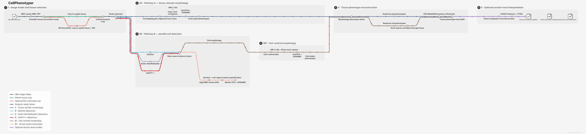

# CellPhenotyper

CellPhenotyper is a Nextflow DSL2 pipeline for H&E tissue image analysis. It runs GrandQC tissue and artifact QC; parallel StarDist, HoVer-Net and CellViT++ multi-detector instance fusion; optional tissue microarray (TMA) analysis; GigaTIME virtual mIF inference; marker quantification; paired UNI-2 embeddings; KODAMA and Leiden clustering; MedSAM tissue-border refinement; full-resolution image-guided cluster-boundary refinement; and final tissue-cluster GeoJSON export.

Final multiclass cluster GeoJSON export uses four-connected, topology-preserving rasterio polygonization of the native-resolution label raster by default. Interior rings and every positive-area annotated component are retained. Unequally noded shared edges are planarized once and rebuilt as label-preserving polygon faces before Shapely coverage simplification reduces vertex count while keeping cluster boundaries coincident. The configured tolerance is an upper search bound rather than an unconditional operation: the exporter measures exact categorical symmetric difference against the unsimplified native coverage and selects the strongest candidate below the declared annotation-error fraction (1% by default). A zero limit requests exact geometry. A final selective shared-boundary pass relaxes only long, implausibly sharp internal vertices; it keeps the external tissue footprint fixed, adds no vertices and reconstructs one mutually exclusive polygon coverage. The production transform uses only the pipeline prediction. Expert annotations are restricted to a separate development benchmark and are neither a pipeline parameter nor an inference input. Per-class hole filling and buffer smoothing remain disabled. The exporter checks every class pair and fails closed instead of publishing a GeoJSON with positive-area overlap; its provenance receipt records the selected raster level, level-zero scaling, connectivity, edge repair, requested and selected tolerance, segment reduction, selective-smoothing settings and displacement, measured fidelity and overlap result. GeoJSON is serialized without optional whitespace to reduce storage without changing geometry.

Its primary intended use is research-only exploratory multimodal characterization of H&E whole-slide images. Cell segmentation, cell-centred phenotyping, grid-based tissue-domain discovery, virtual staining, and outcome prediction are distinct selectable workflows with different observation units and validation requirements; they must not be presented as one interchangeable clinical result.

## Workflow overview



The map distinguishes artifact QC, role-aware multi-detector instance fusion, virtual mIF, TMA analysis, cell-centred and spatial-grid UNI-2 routes, and tissue interpretation. See the [metro-map sources and regeneration instructions](docs/pipeline_metro/README.md) for the curated definition, technical Nextflow DAG, and interactive version.

Before analysis, the conversion stage writes source and converted input-QC JSON reports. They record full-file SHA-256, dimensions, axes, dtype, bit depth, channel/color interpretation, compression, tiling, pyramid levels, all detected physical-resolution sources and any conflicts. Strict defaults reject missing or implausible MPP, anisotropic pixels, contradictory MPP sources without a verified override, non-color converted inputs and non-pyramidal converted images. Brightfield inputs represented as three planar `MINISBLACK` channels, including this layout when exported from Olympus VSI by Bio-Formats, are automatically streamed into an interleaved, pyramidal OME-TIFF with canonical RGB channel order. Source planes are interpreted as `RGB` by default; `--convert_channel_order` accepts any RGB permutation when a scanner exports a different plane order. Lossless TIFF compression retains the literal `RGB` photometric tag; JPEG-in-TIFF uses standard `YCbCr` storage and is decoded to the same canonical RGB samples for analysis. The shared `crop_roi.tif` is also written automatically as a tiled, pyramidal RGB OME-TIFF. It inherits `convert_compression` and `convert_jpeg_quality` from the normalized input, avoiding the major storage expansion caused by lossless re-encoding; its OME dimensions, physical pixel size, codec and pyramid geometry are validated before publication and recorded in `crop_summary.json`.

After a run, begin with `00_execution/index.html`. The review-first landing page places failed or review-required quality signals and the permitted claim ceiling before the image gallery, then links runtimes, disk use and every indexed output. Open `00_execution/specimen_atlas.html` for a specimen-by-specimen review of source morphology, analysis support, cell instances, virtual markers, tissue domains, uncertainty, boundary refinement and optional research endpoints. Every atlas panel states its observation route, unit and interpretation limit; absent layers remain explicit.

Each run also writes `00_execution/uncertainty_register.{json,tsv}`. It covers every analytical stage and distinguishes calibrated uncertainty, descriptive model agreement, repeated-seed stability, technical QC, deterministic transforms, and stages where uncertainty is not quantified. Missing uncertainty must not be interpreted as confidence.

`00_execution/model_inventory.{json,tsv}` records every learned component used by the run, including its upstream source, requested and immutable resolved revisions, checkpoint SHA-256, cache path, license status and training domain. Missing or conflicting evidence becomes a failing release-quality signal even when computation succeeded. See the [learned-model provenance contract](docs/MODEL_PROVENANCE.md).

Main command:

```bash
nextflow run main.nf
```

Validate a YAML or JSON parameter file before execution:

```bash
python bin/validate_pipeline_params.py --params pipeline_paramers.yml
```

## Documentation

- [Installation](INSTALL.md)
- [How to run](TUTORIAL.md)
- [Choose the scientific analysis route](docs/ANALYSIS_ROUTE_GUIDE.md)
- [Linked cell profiles, neighbourhoods, reference atlas and SpatialData](docs/CELL_ATLAS_USAGE.md)
- [Exact cell-to-tissue hierarchy membership](docs/CELL_TISSUE_LINKS.md)
- [Compatibility and known limitations](docs/COMPATIBILITY_MATRIX.md)
- [Reference-standard detector validation protocol](docs/DETECTOR_VALIDATION_PROTOCOL.md)
- [Registered measured-marker validation protocol](docs/VIRTUAL_MARKER_VALIDATION_PROTOCOL.md)
- [Independent UNI-2 route validation protocol](docs/UNI2_ROUTE_VALIDATION_PROTOCOL.md)
- [Human review policy](docs/HUMAN_REVIEW_POLICY.md)
- [Pipeline card](docs/PIPELINE_CARD.md)
- [Learned-model provenance and license gate](docs/MODEL_PROVENANCE.md)
- [Data governance and privacy](docs/DATA_GOVERNANCE.md)
- [Parameters](PARAMETERS.md)
- [Output](OUTPUT.md)
- [Pipeline step differences vs upstream tools](UPSTREAM_DIFFS.md)
- [Release](RELEASE.md)
- [Linux update playbook](LINUX_UPDATE.md)
- [Singularity maintainer guide](singularity/README.md)

## Example input in this repository

- `Data/ROI_A.ome.tif`
- `Data/ROI_A.geojson`
- `Data/ROI_B.ome.tif`
- `Data/ROI_B.geojson`

If `Data/<sample>.geojson` is missing, CellPhenotyper automatically uses the full image as ROI for that sample.

For CZI inputs with multiple scan regions, place the `.czi` file and the region-specific GeoJSON files in the same folder using the naming pattern:

- `<image>.czi`
- `<image>.czi - ScanRegion0.geojson`
- `<image>.czi - ScanRegion1.geojson`

CellPhenotyper resolves one pipeline sample per matching `ScanRegionN` GeoJSON, converts only that CZI region to TIFF, and keeps the region-specific ROI paired with the derived TIFF.

## Runtime behavior (automatic container selection)

Use one profile per run:

- `-profile docker`
- `-profile singularity`

Do not use both profiles in the same run.

Default image selection is automatic (`runtime_image_mode: auto`):

- Docker profile uses GHCR images.
- Singularity profile auto-resolves architecture-specific `.sif` assets when available.
- Singularity/Apptainer GPU roles use `singularity_gpu_image_source: oras` by default, selecting the verified native `2.8-sif-gpu-amd64` SIF from GHCR.
- GPU-capable stages select their image and GPU access per task, honoring supported stage-specific device overrides. KODAMA's CUDA backend also uses this route; CPU KODAMA does not reserve a GPU.
- On arm64, a requested GPU task requires a compatible GPU image; it fails rather than silently selecting a CPU or amd64 image. An explicitly selected CPU-compatible route such as `cell_detection_mode=stardist` remains available.
- On arm64, StarDist defaults to CPU container unless `--enable_stardist_gpu_on_arm64 true`.

The host-side GPU admission hook is retained by both container profiles, and
the selected device is forwarded into the task container. Dynamic admission
exposes one CUDA device: use the task-local ordinal zero, and restrict physical
devices with the inherited `CUDA_VISIBLE_DEVICES` / `NVIDIA_VISIBLE_DEVICES`
allocation. The allocator intersects those restrictions, uses a full GPU UUID
when available, and rejects disabled, ambiguous or unsupported MIG allocations.
Native MPS/Metal requests are not silently converted into Linux-container CPU
jobs. See the [atlas runtime contract](docs/ATLAS_CONTAINER_RUNTIME.md) for
verification scope and remaining limitations.

Currently verified and published:

- Docker GPU amd64 (`v2.8`): `ghcr.io/tkcaccia/cellphenotyper-runtime:2.8-gpu-amd64`
- Docker CPU amd64: `ghcr.io/tkcaccia/cellphenotyper:2.2-amd64`
- Docker CPU arm64: `ghcr.io/tkcaccia/cellphenotyper:0.2.0`
- Legacy Docker GPU amd64: `ghcr.io/tkcaccia/cellphenotyper:2.2-gpu-amd64`
- Published GHCR/ORAS SIF artifacts include the HPC-validated amd64 GPU image `2.8-sif-gpu-amd64`; the existing 2.2 CPU/arm64 assets remain available under `ghcr.io/tkcaccia/cellphenotyper`.

The legacy arm64 GPU artifact is published but is not suitable for every GPU generation. In particular, GB10-class (`sm_121`) systems require a rebuilt arm64 GPU SIF with a compatible CUDA/PyTorch stack.
The amd64 GPU SIF exceeds the GitHub Release 2 GiB asset limit and is therefore distributed natively through GHCR/ORAS. Clusters may pull it once to shared storage and reuse the checksum-verified local file.

Verify actual published Docker tags before instructing users to pull them:

```bash
docker buildx imagetools inspect ghcr.io/tkcaccia/cellphenotyper:2.2-amd64
docker buildx imagetools inspect ghcr.io/tkcaccia/cellphenotyper-runtime:2.8-gpu-amd64
```

## UNI-2 token setup (required)

1. Create/sign in at [Hugging Face](https://huggingface.co).
2. Request access to [MahmoodLab/UNI2-h](https://huggingface.co/MahmoodLab/UNI2-h).
3. Create a read token at [Hugging Face tokens](https://huggingface.co/settings/tokens).
4. In the project root:

```bash
printf 'HF_UNI2="%s"\n' "<your_hf_token>" > tokens.env
source tokens.env
export HF_TOKEN="${HF_UNI2}"
```

Run these `source/export` commands in every new shell before starting Nextflow.
For Docker profile runs, keep `tokens.env` in the repository root (default bind-mounted working directory) and pass `--hf_token_env_file tokens.env`.

If you get `401 Unauthorized` during UNI-2 download, check token validity and model access approval.

## Project-local model caches (default)

StarDist and Hugging Face model downloads now default to project-local cache paths:

- StarDist: `${REPO}/.keras`
- UNI-2 / GigaTIME: `${REPO}/.hf_cache`

This matters for Docker reruns: because both caches live inside the repository, they are visible inside containerized Nextflow tasks and can be reused offline.

One-time StarDist predownload into the default project cache:

```bash
mkdir -p .keras/models
curl -L --retry 5 --connect-timeout 30 \
  -o .keras/models/python_2D_versatile_he.zip \
  https://github.com/stardist/stardist-models/releases/download/v0.1/python_2D_versatile_he.zip
```

On the first StarDist run, CellPhenotyper will normalize and extract that zip into `.keras/models/StarDist2D/...` automatically. Later reruns reuse the local cache and do not re-download the pretrained model.

One-time Hugging Face predownload into the default project cache:

```bash
source tokens.env
export HF_TOKEN="${HF_UNI2}"
export HF_HOME="${PWD}/.hf_cache"
export HF_HUB_CACHE="${HF_HOME}/hub"

python - <<'PY'
import os
from huggingface_hub import snapshot_download

snapshot_download("MahmoodLab/UNI2-h", token=os.environ["HF_TOKEN"].strip())
snapshot_download("prov-gigatime/GigaTIME", token=os.environ["HF_TOKEN"].strip())
print("HF caches ready")
PY
```

Later Docker reruns can set `--hf_hub_offline true` and reuse the same mounted cache for both UNI-2 and GigaTIME.

## GrandQC tissue and artifact gating

GrandQC is mandatory and runs once on the normalized full image before every analysis route. The wrapper uses the released tissue detector and official 512 x 512 artifact inference geometry in FP32, with 50% overlap and smooth probability blending. Every image size uses the same merge algorithm: class-score and overlap-weight accumulators are disk-backed memory maps and are finalized in bounded row blocks. `grandqc_artifact_mpp_model=auto` selects the 1.0-MPP checkpoint below 0.12 um/px, the 1.5-MPP checkpoint below 0.20 um/px, and the empirically validated 2.0-MPP checkpoint for conventional 20x/40x WSI metadata. The selected model, effective MPP, merge contract, class fractions, and checkpoint paths are recorded in the GrandQC summary.

Only GrandQC normal-tissue pixels are retained in the clean-tissue mask; artifact classes and background are excluded. The second operation computes the bounding box of GrandQC clean tissue intersected with the optional ROI, streams that crop from the WSI, shifts the ROI, and propagates the same tissue/ROI support. This one crop is shared by StarDist, HoVer-Net MoNuSAC, CellViT++, GigaTIME, UNI-2, KODAMA and all spatial outputs. Each detector removes cells whose centroid is outside the shared support before consensus. The crop-aligned mask is also published as `04_tissue_mask` and replaces the former heuristic tissue-mask calculation for grid filtering, cluster growth and MedSAM refinement.

## Input ROI mask

Every provided or generated ROI is hashed and validated against the exact converted level-0 image before cropping. The default gate requires polygonal, valid, finite and in-bounds geometry; rejects conflicting source-image identifiers and geographic/world CRS declarations; preserves and counts holes; and never repairs self-intersections or clips coordinates silently. Legacy files without explicit image/coordinate-space metadata remain usable with visible warnings. The immutable QC record is `06_roi/<sample>/<sample>.roi_qc.json`.

When an input ROI GeoJSON is present, the pipeline writes a crop-aligned mask to `06_roi/<sample>/` using the same cropped ROI coordinates generated for StarDist. The mask preserves distinct annotation classes from the input GeoJSON whenever those labels are present in properties such as `classification.name`, and it also writes:

- a colored preview overlay PNG
- a JSON value-to-label map recording the class IDs used in the rasterized mask

## TMA Detection

After StarDist, the optional `04_TMA` step detects whether the crop behaves like a tissue microarray by segmenting compact separated tissue cores on a thumbnail and checking spot count, spot-size consistency, and grid-like layout. When a TMA is detected it writes `04_TMA/<sample>/tma_<sample>/<sample>_tma_spots.geojson`; in all cases it writes `04_TMA/<sample>/tma_<sample>/<sample>_objects_tma_assigned.csv`, preserving the StarDist object rows and appending `tma_spot_*` columns.

## Optional GigaTIME marker quantification

GigaTIME is disabled by default. When explicitly enabled, the pipeline quantifies the crop-aligned GigaTIME marker stack over:

- canonical nuclei labels (consensus or explicit StarDist route)
- whole-cell approximations, retaining the legacy `cyto` filename
- perinuclear rings excluding all nuclear pixels when physical expansion is enabled

Physical expansion defaults to `expand_um=3.0`, is constrained by tissue support,
and records crowding/truncation QC. These masks are not inferred cell membranes.
When enabled, the default stored marker output retains all 23 channels in float32; versioned
schema/checkpoint/precision/mask checks reject non-equivalent restarts. Old
subset/uint8 outputs remain historical research artifacts, not equivalent sources
for authoritative requantification. See the [atlas migration notes](docs/CELL_ATLAS_USAGE.md).

The source MPP is recovered from TIFF metadata or the StarDist coordinate metadata. With strict target-MPP mode enabled, CellPhenotyper resamples by the exact floating-point MPP ratio before tiling, including lazy pyvips upsampling when the source is coarser than the requested model resolution. The persisted Zarr and pyramidal OME-TIFF record the resulting physical pixel size and keep markers as separate channels.

Persisted outputs disable whole-block background skipping by default. This avoids the rectangular zero-fill transitions found during WSI validation. Every saved marker channel is checked at every inference-block boundary against nearby within-block gradients; `gigatime_seam_qc.json` and `gigatime_seam_qc.png` record the results, and the default `gigatime_seam_qc_mode=fail` prevents a systematically discontinuous image from being published as successful.

GigaTIME outputs are sigmoid-bounded, **uncalibrated virtual-marker scores**, not measured protein abundance or calibrated probabilities. The legacy `gigatime_probs.*` and `*_mean_intensity.csv` filenames are retained for compatibility only. This contract is stored in `gigatime_metadata.json`, OME-Zarr attributes, every quantification row, and each quantification summary. `gigatime_marker_score_qc.{json,tsv,png}` samples the inference grid deterministically during the existing tiled pass and reports per-marker distribution, p05-p95 dynamic range, near-zero and saturation fractions, GrandQC clean-tissue versus background means, and channel correlations. These checks can reveal technical collapse or scale anomalies; they do not validate marker biology.

The corrected path was technically validated on the cached Visium HD breast crop: the archived skip-enabled result failed 21 of 180 channel-boundary tests, while the corrected output failed 0 of 140 execution-block tests, 0 of 180 tests at the exact archived boundaries, and 0 of 1,120 tests over the complete 128-pixel inference-patch grid. This demonstrates image continuity for one WSI, not biological accuracy of the virtual markers; the reproducible record is in `audits/gigatime_seam_validation_20260903/`.

Outputs are written per sample to:

- `05_gigatime/<sample>/quantification_<sample>/<sample>_nuclei_gigatime_quantification.csv`
- `05_gigatime/<sample>/quantification_<sample>/<sample>_nuclei_gigatime_mean_intensity.csv`
- `05_gigatime/<sample>/quantification_<sample>/<sample>_nuclei_gigatime_intensity_stats.csv`
- `05_gigatime/<sample>/quantification_<sample>/<sample>_cyto_gigatime_quantification.csv`
- `05_gigatime/<sample>/quantification_<sample>/<sample>_cyto_gigatime_mean_intensity.csv`
- `05_gigatime/<sample>/quantification_<sample>/<sample>_cyto_gigatime_intensity_stats.csv`
- `05_gigatime/<sample>/gigatime_<sample>/gigatime_marker_score_qc.json`
- `05_gigatime/<sample>/gigatime_<sample>/gigatime_marker_score_qc.tsv`
- `05_gigatime/<sample>/gigatime_<sample>/gigatime_marker_score_qc.png`

The `*_gigatime_quantification.csv` file is a wide per-object table in the same spirit as mcMicro-style single-cell quantification outputs: one row per label with the segmentation compartment, score semantics, area, centroid, bounding box, and per-marker mean/sum/max score columns. The legacy mean-intensity CSV remains convenient for lightweight downstream modeling, while the stats CSV preserves the explicit summary fields.

When `gigatime_kodama_enable=true`, biological/counterstain marker means from nuclei and whole-cell tables are standardized through the regular PCA/KODAMA implementation. Background channels TRITC/Cy5 are excluded. Duplicate IDs, unequal cell populations and missing/nonfinite marker values fail instead of silently dropping cells or imputing values. This independent representation is written to `10_kodama/<sample>/gigatime/gigatime_kodama_output`; it does not replace the UNI-2 route.

When `uni2_sampling_mode=both`, cell-centred KODAMA coordinates are aggregated within retained grid cores and compared with the primary grid representation. The report uses coverage, Procrustes agreement, pairwise distances, neighborhood overlap, spatial coherence, and cross-validated GigaTIME marker proxies when available. Because those markers are predicted from the same H&E image, they are a biological proxy rather than independent validation, and the software does not select a preferred route.

## Optional dual clustering outputs

After KODAMA, CellPhenotyper produces the `standard` clustering variant by default. Set `--cluster_secondary_variant fine` to add a second branch:

- `standard`: the current/default clustering behavior
- `fine`: a slightly higher-resolution clustering that prefers a few more clusters when the KODAMA clustering score stays close to the standard solution

Every clustering variant is repeated across configured seeds. Weak KNN assignments or seed-unstable observations can be retained in the raw `cluster` column while omitted from `interpretable_cluster`. The pipeline also reports spatial coherence and optional GigaTIME marker enrichment and generates a randomized, blinded region-review packet. These are complementary evidence sources, not a rule for choosing the most visually appealing clustering or naming biological classes.

Downstream stages run independently for every configured variant:

- `11_clustering`
- `12_cluster_mask`
- `13_grown_tissue` (cell-centred route only; grid masks bypass growth)
- `14_medsam_refine_tissue`
- `15_cluster_geojson`

Variant-specific filenames are written inside the per-sample folders, for example:

- `<sample>_standard_cluster.csv`
- `<sample>_fine_cluster.csv`
- `<sample>_standard_grown_mask_refined.ome.tif`
- `<sample>_fine_grown_mask_refined.ome.tif`
- `<sample>_standard_grown_mask_smooth_class.geojson`
- `<sample>_fine_grown_mask_smooth_class.geojson`

Step `14_medsam_refine_tissue` also copies the corresponding KODAMA membership PNG for each variant into the MedSAM output folder as:

- `<sample>_standard_medsam_kodama_membership.png`
- `<sample>_fine_medsam_kodama_membership.png`

That keeps the refined tissue result side by side with the clustering visualization that produced it.

UNI-2 embeddings are generated after their required observations are available. `--uni2_sampling_mode grid` is the default and drives UNI-2, KODAMA, clustering, and cluster-mask generation from regular GrandQC-filtered spatial observations without running a cell-centred route. `--uni2_sampling_mode cells` explicitly selects nucleus-centred observations. `--uni2_sampling_mode both` keeps the grid route primary and, after it releases the GPU, runs a complete independent cell-centred route under the `<sample>__cells` namespace: UNI-2, KODAMA, clustering, sparse cell-mask construction, tissue growth, MedSAM refinement, and GeoJSON export. The unsuffixed grid mask bypasses cell-mask growth. In grid modes, the calibrated source-pixel stride equals the fixed 90-pixel inner square in UNI-2 input space, so inner-square cores are side by side while the larger 224-pixel context tiles overlap. The compact grid CSV/JSON avoids a full-resolution intermediate label image, and `09_grid_tiles/<sample>/*_uni2_grid_preview.png` provides QC.

Both sampling modes use the optimized paired `tile` + `inner_square` pass: one Python process loads the selected registered encoder once and derives both representations from the same forward pass with model-specific spatial-token handling. UNI2-h remains the default. Experimental `virchow`, `virchow2`, and `phikon-v2` adapters preserve the same observations, 224-pixel tensor geometry, physical sampling, KODAMA settings and clustering policy; Virchow/Virchow2 use CLS-plus-mean-patch pooling and Virchow2 explicitly excludes its four register tokens from spatial and inner-square features. Conservative model-specific batch caps supplement OOM backoff. The source crop is calibrated to `uni2_target_mpp` before the input transform. Per-observation PNG tile export is disabled by default because KODAMA consumes embedding shards; enable `--uni2_save_tiles true` only for QC/debugging. Alternative checkpoints must be approved and staged in the shared Hugging Face cache on the execution host; the pipeline does not acquire access or change the encoder automatically.

PathSegmentor is also available as an opt-in, CUDA-only evidence branch (`pathsegmentor_enable: true`) using an explicitly supplied pinned source checkout, config and checkpoint. It processes overlapping 1024-pixel fields at 0.25 µm/px, clips all semantic probabilities to the existing GrandQC tissue support, and publishes raw probabilities and tile scores under `09b_pathsegmentor`. After KODAMA clustering, `09c_pathsegmentor_annotations` contains per-grid and per-cell prompt scores plus descriptive cluster summaries. `pathsegmentor_guided_refine_enable` adds a separate `14b_pathsegmentor_refine` sensitivity result: semantic prototypes are learned from eroded KODAMA cluster interiors and may relabel only a declared boundary band (and, only when explicitly enabled, unlabeled pixels inside GrandQC tissue). This branch never changes KODAMA fitting, raw cluster masks, or the default MedSAM output. See [the foundation-encoder and PathSegmentor comparison contract](docs/FOUNDATION_ENCODER_COMPARISON.md).

`--uni2_embedding_storage binary` separates numerical feature arrays from small row metadata, avoiding feature-CSV parsing in R/KODAMA and Python profile/hierarchy consumers. It preserves explicit IDs, precision and checksummed payloads; CSV remains the compatibility default. See [binary storage and benchmark scope](docs/UNI2_BINARY_STORAGE.md). Changing storage requires compatible new extraction outputs, not mixing formats in an existing result directory.

Example grid run or restart:

```bash
nextflow run main.nf -profile singularity -params-file pipeline_paramers.yml \
  --uni2_sampling_mode grid \
  --start_point grid_tiles \
  --end_point cluster_geojson \
  -resume
```

Before MedSAM, neighbouring KODAMA labels compete inside a bounded internal-boundary error band. A deterministic mean-field annealing schedule minimizes a robust Lab/optical-density data term plus an edge-weighted, distance-weighted eight-neighbour Potts penalty; only a label present on the local wand-like frontier may invade a pixel. Protected cluster cores, the tissue/background footprint and GrandQC exclusions cannot change. MedSAM is then applied per cluster label using the optimized categorical mask and overlapping cluster-border tiles on the pipeline-resolved GPU. A tile containing only one cluster remains valid because MedSAM refines that cluster's external tissue support. After MedSAM cleanup, an optional marker-controlled watershed can snap residual internal boundaries to a configurable spatial scale of luminance, Lab, optical-density, or combined Lab/OD H&E gradients within a bounded 64-pixel band; zero gradient smoothing reproduces the historical microtexture-sensitive route. For exactly two nonzero tissue labels, the default automatic appearance phase then detects large coherent assignment errors from multiscale Lab/optical-density H&E features and pipeline-derived eroded label cores. None of these production stages consumes expert annotations. The summary and QC panel distinguish the grown input, pre-MedSAM competition, raw MedSAM predictions, cleaned labels and the image-guided final result.

## Linux quick run

Before every run, sync and verify you are on the latest `main`:

```bash
git fetch origin
git checkout main
git pull --ff-only
git rev-parse --short HEAD
git rev-parse --short origin/main
git status --short
```

`HEAD` and `origin/main` must match, and `git status --short` should be empty.

Linux runtime precheck:

```bash
java -version
nextflow -version
```

If `nextflow` is not in PATH in your shell, use `/home/<user>/.local/bin/nextflow`.

```bash
git clone https://github.com/tkcaccia/CellPhenotyper.git
cd CellPhenotyper
source tokens.env
export HF_TOKEN="${HF_UNI2}"
```

Docker:

```bash
nextflow run main.nf \
  -profile docker \
  -params-file pipeline_paramers.yml \
  --folder_input Data \
  --outdir_base results_example
```

Docker (GPU, Linux amd64 + NVIDIA):

```bash
nextflow run main.nf \
  -profile docker \
  -params-file pipeline_paramers.yml \
  --folder_input Data \
  --outdir_base results_example_gpu \
  --compute_device gpu \
  --host_arch amd64 \
  --gpu_container_image ghcr.io/tkcaccia/cellphenotyper-runtime:2.8-gpu-amd64 \
  --hf_token_env_file tokens.env \
  --hf_token_env_var_name HF_UNI2
```

Singularity/Apptainer:

```bash
nextflow run main.nf \
  -profile singularity \
  -params-file pipeline_paramers.yml \
  --folder_input Data \
  --outdir_base results_example
```

Singularity/Apptainer (GPU, Linux amd64 + NVIDIA):

```bash
nextflow run main.nf \
  -profile singularity \
  -params-file pipeline_paramers.yml \
  --folder_input Data \
  --outdir_base results_example_gpu \
  --compute_device gpu \
  --host_arch amd64
```

For HPC clusters without outbound internet from compute nodes, use this offline-ready flow (CPU or GPU):

```bash
# 0) paths
export REPO=/scratch/<project>/CellPhenotyper
export BASE=/scratch/<project>/cellphenotyper_cache
export SIF_DIR=$BASE/singularity
export KERAS_HOME=$BASE/keras
export HF_HOME=$BASE/hf
export HF_HUB_CACHE=$HF_HOME/hub
export SIF=$SIF_DIR/cellphenotyper-2.2-amd64.sif
mkdir -p "$SIF_DIR" "$KERAS_HOME/models/StarDist2D" "$HF_HUB_CACHE"

# 1) token file must define HF_TOKEN=...
source /scratch/<project>/tokens.env

# 2) pull prebuilt SIF once (on a node with internet)
apptainer pull -F "$SIF" docker://ghcr.io/tkcaccia/cellphenotyper:2.2-amd64

# 3) predownload StarDist model and normalize to expected local folder
curl -L -o "$KERAS_HOME/models/StarDist2D/python_2D_versatile_he.zip" \
  https://github.com/stardist/stardist-models/releases/download/v0.1/python_2D_versatile_he.zip
mkdir -p /tmp/stardist_unpack
unzip -o "$KERAS_HOME/models/StarDist2D/python_2D_versatile_he.zip" -d /tmp/stardist_unpack
mkdir -p "$KERAS_HOME/models/StarDist2D/2D_versatile_he"
if [ -d /tmp/stardist_unpack/python_2D_versatile_he ]; then
  cp -a /tmp/stardist_unpack/python_2D_versatile_he/. "$KERAS_HOME/models/StarDist2D/2D_versatile_he/"
else
  cp -a /tmp/stardist_unpack/. "$KERAS_HOME/models/StarDist2D/2D_versatile_he/"
fi

# 4) predownload UNI2 model once
export APPTAINERENV_HF_TOKEN="$HF_TOKEN"
export APPTAINERENV_HF_HOME="$HF_HOME"
export APPTAINERENV_HF_HUB_CACHE="$HF_HUB_CACHE"
apptainer exec "$SIF" python - <<'PY'
import os
from huggingface_hub import snapshot_download, hf_hub_download

repo = "MahmoodLab/UNI2-h"
snapshot_download(repo, token=os.environ.get("HF_TOKEN", "").strip() or None, local_files_only=False)

# Force actual weight file in cache for strict offline runs.
try:
    p = hf_hub_download(repo_id=repo, filename="model.safetensors", token=os.environ.get("HF_TOKEN", "").strip() or None, local_files_only=False)
    print("UNI2 weight cached:", p)
except Exception:
    p = hf_hub_download(repo_id=repo, filename="pytorch_model.bin", token=os.environ.get("HF_TOKEN", "").strip() or None, local_files_only=False)
    print("UNI2 weight cached:", p)

print("UNI2 cache ready")
PY

# 5) offline cache env for all Nextflow tasks
export APPTAINERENV_KERAS_HOME="$KERAS_HOME"
export APPTAINERENV_XDG_CACHE_HOME="$KERAS_HOME"
export SINGULARITYENV_KERAS_HOME="$KERAS_HOME"
export SINGULARITYENV_XDG_CACHE_HOME="$KERAS_HOME"
export APPTAINERENV_HF_HOME="$HF_HOME"
export APPTAINERENV_HF_HUB_CACHE="$HF_HUB_CACHE"
export APPTAINERENV_HF_TOKEN="$HF_TOKEN"
export APPTAINERENV_HF_HUB_OFFLINE=1
export SINGULARITYENV_HF_HOME="$APPTAINERENV_HF_HOME"
export SINGULARITYENV_HF_HUB_CACHE="$APPTAINERENV_HF_HUB_CACHE"
export SINGULARITYENV_HF_TOKEN="$APPTAINERENV_HF_TOKEN"
export SINGULARITYENV_HF_HUB_OFFLINE="$APPTAINERENV_HF_HUB_OFFLINE"

# 6) run (CPU example; compute_device can be cpu or gpu)
nextflow run "$REPO/main.nf" \
  -profile singularity \
  -params-file "$REPO/pipeline_paramers.yml" \
  --folder_input "$REPO/Data" \
  --outdir_base "$REPO/results_hpc_offline" \
  --compute_device cpu \
  --host_arch amd64 \
  --runtime_image_mode manual \
  --singularity_image "$SIF" \
  --stardist_keras_home "$KERAS_HOME" \
  --hf_home "$HF_HOME" \
  --hf_hub_cache "$HF_HUB_CACHE" \
  --hf_hub_offline true \
  --max_cpus "${SLURM_CPUS_PER_TASK:-8}" \
  -resume
```

Important:
- Run inside a scheduler allocation (`srun`, `sbatch`, etc.) so Nextflow sees the allocated CPUs.
- Do not pass `--stardist_pretrained_zip` when the extracted folder already exists under `.../StarDist2D/2D_versatile_he`.
- In `-profile singularity`, amd64 GPU roles resolve `oras://ghcr.io/tkcaccia/cellphenotyper:2.8-sif-gpu-amd64` by default. A cluster may instead pre-pull `cellphenotyper-2.8-gpu-amd64.sif` to shared storage and pass its absolute path through `--gpu_container_image`.

Singularity/Apptainer (GPU, Linux arm64 + NVIDIA):

```bash
nextflow run main.nf \
  -profile singularity \
  -params-file pipeline_paramers.yml \
  --folder_input Data \
  --outdir_base results_example_gpu_arm64 \
  --compute_device gpu \
  --host_arch arm64 \
  --enable_gpu_on_arm64 true
```

Note: on GB10-class arm64 GPUs (`sm_121`), use a locally rebuilt arm64 GPU SIF from `singularity/cellphenotyper_full_gpu.def` (nightly `cu130` PyTorch). The legacy `2.2-gpu-arm64` asset may expose CUDA but still fail at runtime with `no kernel image is available`.

Rerun only `cluster_mask` and `grow_tissue` for the cell-centred route:

```bash
nextflow run main.nf \
  -profile singularity \
  -params-file pipeline_paramers.yml \
  --folder_input Data \
  --outdir_base results_example \
  --uni2_sampling_mode cells \
  --start_point cluster_mask \
  --end_point grow_tissue
```

Grid-primary runs intentionally skip `grow_tissue`; use `--start_point cluster_mask --end_point medsam_refine` to reconstruct and refine a grid mask.

## macOS quick run

Docker (native with Docker Desktop):

```bash
git clone https://github.com/tkcaccia/CellPhenotyper.git
cd CellPhenotyper
source tokens.env
export HF_TOKEN="${HF_UNI2}"
nextflow run main.nf \
  -profile docker \
  -params-file pipeline_paramers.yml \
  --folder_input Data \
  --outdir_base results_example
```

Singularity (via Lima Linux VM):

```bash
limactl shell default
mkdir -p ~/CellPhenotyper
rsync -a --delete /Users/<your-user>/Documents/CellPhenotyper/ ~/CellPhenotyper/
cd ~/CellPhenotyper
source tokens.env
export HF_TOKEN="${HF_UNI2}"
nextflow run main.nf \
  -profile singularity \
  -params-file pipeline_paramers.yml \
  --folder_input Data \
  --outdir_base results_example
```

Important for Lima: run from a writable Linux path (for example `~/CellPhenotyper`), not from `/Users/...` mount paths.
On Apple Silicon/Linux arm64, GPU mode requires an arm64-compatible GPU container asset (`singularity_gpu_asset_arm64` or `gpu_container_image`).

## Check status and outputs

Run status:

```bash
ps aux | grep -E 'nextflow|java' | grep -v grep
tail -n 50 -f .nextflow.log
```

Final output:

- `results_example/15_cluster_geojson/ROI_A/ROI_A_standard_grown_mask_smooth_class.geojson`
- `results_example/15_cluster_geojson/ROI_B/ROI_B_standard_grown_mask_smooth_class.geojson`
- `results_example/05_gigatime/ROI_A/gigatime_ROI_A_ometiff/gigatime_probs.ome.tif`
- `results_example/05_gigatime/ROI_B/gigatime_ROI_B_ometiff/gigatime_probs.ome.tif`
- `results_example/06_roi/ROI_A/ROI_A_input_roi_mask.tif` if `ROI_A.geojson` was supplied
- `results_example/06_roi/ROI_B/ROI_B_input_roi_mask.tif` if `ROI_B.geojson` was supplied
- `results_example/06_roi/ROI_A/ROI_A_input_roi_mask_preview.png` if `ROI_A.geojson` was supplied
- `results_example/06_roi/ROI_B/ROI_B_input_roi_mask_preview.png` if `ROI_B.geojson` was supplied
- `results_example/06_roi/ROI_A/ROI_A_input_roi_mask_labels.json` if `ROI_A.geojson` was supplied
- `results_example/06_roi/ROI_B/ROI_B_input_roi_mask_labels.json` if `ROI_B.geojson` was supplied
- `results_example/05_gigatime/ROI_A/quantification_ROI_A/ROI_A_nuclei_gigatime_quantification.csv`
- `results_example/05_gigatime/ROI_A/quantification_ROI_A/ROI_A_cyto_gigatime_quantification.csv`

Execution report:

- `results_example/00_execution/final_report.md`
- `results_example/00_execution/final_report.json`

Copy results from Lima to macOS host:

```bash
limactl copy default:/home/<lima-user>/CellPhenotyper/results_example \
  /Users/<your-user>/Documents/CellPhenotyper/
```

## Maintainer: publish updated containers

Docker and Singularity build/publish workflows are documented here:

- [Release](RELEASE.md)
- [Singularity maintainer guide](singularity/README.md)
- [Linux update playbook](LINUX_UPDATE.md)

Minimal Docker publish example:

```bash
export GHCR_USER="tkcaccia"
source GHCRtoken.env
export TAG="<new-version>-amd64"
export IMAGE="ghcr.io/${GHCR_USER}/cellphenotyper:${TAG}"
echo "$GHCR_TOKEN" | docker login ghcr.io -u "$GHCR_USER" --password-stdin
docker build -f docker/Dockerfile.full.cpu -t "${IMAGE}" .
docker push "${IMAGE}"
```
Cell identification has an explicit, hardware-independent scientific mode. The shipped default, `cell_detection_mode=stardist`, runs only StarDist. The optional `cell_detection_mode=consensus` route adds HoVer-Net MoNuSAC and CellViT++ on the same MPP-aware crop and GrandQC mask. HoVer-Net defaults to a bounded-disk overlap-tiled route: only GrandQC-supported 4,096-pixel cores run, a 256-pixel halo preserves local context, and centroid ownership removes halo duplicates without slide-wide prediction maps. At most 64 normalized input tiles exist simultaneously. The detectors have no inter-detector dependency and fusion alone waits for all three. In consensus mode, canonical instances require spatial agreement between the broad-scope StarDist and CellViT++ detectors by default. HoVer-Net MoNuSAC is recorded separately as scoped supporting evidence and does not inflate the broad-detector agreement score or shift the canonical centroid. Its compact gzip JSON therefore omits redundant contours by default. The legacy two-of-any-three policy is available only through `--cell_consensus_fusion_acceptance_policy any_two`. Consensus requires a GPU and fails if only CPU execution is resolved; the pipeline never changes the cell population merely because hardware differs.

GigaTIME is also optional and disabled by default. A normal run does not require a GigaTIME model path or token and does not schedule virtual-marker inference, marker quantification, or marker-derived KODAMA. Enable the branch explicitly with `--gigatime_enable true`; enable its dependent outputs separately when required.

Every run writes `00_execution/analysis_contract.json` and `00_execution/validation_readiness.json`. An optional `--study_manifest` based on `resources/study_manifest.template.json` declares the intended use, primary endpoint, statistical unit, cohort independence, reference standard and prespecification. `--evidence_gate_mode warn` keeps exploratory runs usable while limiting claims in the report; `fail` rejects an incomplete testing declaration. Passing this schema check does not verify accuracy or clinical validity.

All GPU-capable processes use a host-wide admission layer. Before launch, a task selects one visible NVIDIA device with enough live free VRAM, obtains an exclusive task slot plus memory tokens, and receives that device through `CUDA_VISIBLE_DEVICES`. Stage-specific reservations permit safe concurrency on larger GPUs while preventing concurrent HoVer-Net, CellViT++, UNI-2, GigaTIME or MedSAM workloads from exhausting smaller devices.

Pipeline-wide hardware auto-tuning is enabled by default. At startup, CellPhenotyper detects the scheduler/container CPU allowance, effective RAM limit, GPU inventory and VRAM, then resolves CPU, RAM and worker settings for every stage. GPU inference wrappers choose batches from live free VRAM on the device assigned by the admission layer, while OOM-aware stages back off automatically. The resolved per-stage plan is saved as `00_execution/hardware_plan.json`. Auto-tuning changes execution settings only and never changes the ROI, MPP, models, detector route, UNI-2 feature definition, KODAMA dimensions or clustering semantics. See [hardware auto-tuning](docs/HARDWARE_AUTOTUNING.md).

Before any image process is submitted, the default storage preflight probes each WSI, adjusts conservatively for a discoverable ROI, estimates active-stage output/work/cache growth, aggregates paths that share a filesystem, and separates expected demand from restart worst-case demand. Expected-capacity failure stops the run; restart-only insufficiency is reported as a warning. The complete calculation is saved as `00_execution/storage_preflight.json`. See [storage preflight](docs/STORAGE_PREFLIGHT.md).

On the cell-centred route, sparse cell-supported cluster labels are grown through tissue before MedSAM. On the grid route, adjacent inner cores already form a dense spatial cluster mask, so `GROW_TO_TISSUE` is skipped and MedSAM receives the grid cluster mask directly as both seed and baseline. MedSAM also receives the crop-aligned GrandQC tissue/ROI mask. GrandQC background and artifact pixels act as hard negatives inside refinement: seeds, dilation envelopes, prompts, editable bands, intermediate predictions, hole filling, resumed checkpoints and final labels are constrained to clean tissue. The stage asserts zero final leakage and publishes a dedicated `*_medsam_grandqc_empty_exclusion.png` QC map alongside pixel-level exclusion metrics.

Normalized HoVer-Net and CellViT++ outputs expose both the upstream numeric `type_id` and a readable `type` name. MoNuSAC names are `background`, `epithelial`, `lymphocyte`, `macrophage`, and `neutrophil`; CellViT++ PanNuke names are `neoplastic`, `inflammatory`, `connective`, `dead`, and `epithelial`. The official MoNuSAC label scope is not exhaustive: fibroblasts and other nuclei outside its four positive classes can be treated as background. Therefore HoVer-Net MoNuSAC totals are expected to be lower than general-nucleus detectors and are interpreted as class-specific supporting evidence, not a standalone cellularity estimate. Consensus QC reports both the all-detector count ratio and the StarDist/CellViT++ broad-scope ratio so this distinction is visible.

## Neoplastic Section to PathoFMPred

When `--titan_enable true` is set, CellPhenotyper treats each connected polygon in the final tissue GeoJSON as a section, streams the consensus cell table through a spatial index, and counts named CellViT++ `neoplastic` cells in each polygon. It selects the section with the largest neoplastic count, with total cells, area, and stable section ID used only as deterministic ties. Stage 16 exports the selected full-resolution masked section, mask, original/crop GeoJSON, coordinate shift, count table, summary, and preview.

Stage 17 samples the selected section at the physical equivalent of 512 pixels at 0.5 microns per pixel. It uses the official gated TITAN implementation and its CONCH v1.5 patch encoder, then writes one 768-dimensional section vector with columns `titan_000` through `titan_767`. The TITAN model/cache remains external to the run and work directories to avoid duplication.

With `--pathofmpred_enable true --pathofmpred_cancer BRCA`, stage 18 passes the named TITAN vector to the protected PathoFMPred R package. The package is loaded from `pathofmpred_library_dir` and is not baked into the public runtime image. PathoFMPred scores are TCGA-derived research estimates without independent external clinical validation; binary outputs are not calibrated probabilities.

Example GPU run using a checksum-verified local TITAN snapshot:

```bash
nextflow run main.nf -profile docker \
  --image_input /data/breast.tif \
  --roi_geojson /data/breast.geojson \
  --outdir_base /results/breast \
  --compute_device gpu \
  --cell_detection_mode consensus \
  --titan_enable true \
  --titan_model /models/titan/dac6773d \
  --titan_offline true \
  --pathofmpred_enable true \
  --pathofmpred_cancer BRCA \
  --pathofmpred_library_dir /models/pathofmpred/R_library
```

For a cohort where every sample must have its own top-level result folder, use
the serial batch launcher. It produces `results/<sample>/01_input`,
`results/<sample>/02_grandqc`, and so on, with an independent resumable
Nextflow work directory and console log for each sample:

```bash
python bin/run_sample_batch.py \
  --input-dir /data/cohort \
  --output-root /results/cohort \
  --profile docker \
  -- --run_full_pipeline true --compute_device gpu
```

The launcher runs samples serially and removes each successful sample's
isolated Nextflow work directory by default, after its outputs and completion
marker are durable. Failed or interrupted sample work is retained for
`-resume`. On a later batch invocation, a sample is skipped only when its
completion marker matches the input inventory, resolved parameters, forwarded
arguments and pipeline-source digest. Use `--keep-work-on-success` for
debugging or `--rerun-completed` to ignore matching completion markers.

Olympus `.vsi` inputs are supported when the VSI header and its required
`_<sample>_` companion directory remain together in the input folder. When the
selected series is stored as three grayscale planes, CellPhenotyper joins them
into explicit RGB automatically. The source planes are assumed to be `RGB`; use
`--convert_channel_order BGR` (or another RGB permutation) only when scanner
metadata or visual QC establishes a different source order. The published
OME-TIFF is always canonical RGB. Before each serial VSI run, the launcher uses
the configured runtime image to query the same unflattened Bio-Formats series
selected for conversion and supplies its full dimensions and physical pixel
sizes to storage preflight. This prevents the small preview stored in the VSI
header from being budgeted as if it were the whole slide.

Input and analysis-crop storage compression is configurable with
`--convert_compression JPEG|LZW|DEFLATE|NONE`. `JPEG` is lossy and uses
`--convert_jpeg_quality` (1-100); `LZW` and `DEFLATE` are lossless. The same
codec is used for the converted OME-TIFF and the tiled, pyramidal
`crop_roi.tif`. Downstream models, including HoVer-Net, read those compressed
TIFFs directly and decode only the tiles needed for computation.

GigaTIME still predicts all 23 virtual-marker channels and performs integrated
full-precision nucleus, cytoplasm and perinuclear-ring quantification during
the tiled pass. To keep whole-slide cohorts tractable, the default does not
also persist a dense 23-channel WSI (`gigatime_output_format=none`,
`gigatime_export_ometiff=false`). Dense Zarr and pyramidal OME-TIFF exports are
explicit opt-ins and are capacity-checked before inference.

See `OUTPUT.md` for the complete stage 16-18 artifacts and `PARAMETERS.md` for restart points. A restart at `titan` reuses stage 16; a restart at `pathofmpred` reuses the existing TITAN CSV.
